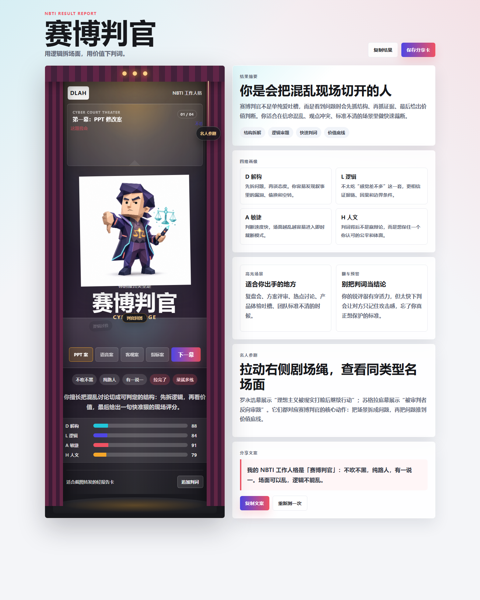

# NBTI Report Share Page

这是一个独立静态前端页面，聚焦 NBTI 报告分享页，不依赖 `NBTI_mwb` 或其他 demo 的运行时。

## 打开方式

直接用浏览器打开仓库根目录的 `index.html`：

```text
index.html
```

## 效果截图



## 维护规则

- 每次页面视觉或交互变更后，都要重新生成并提交对应效果截图。
- 当前主截图：`screenshots/report-share-page.png`

## 当前页面

- 主人物：`DLAH / 赛博判官`
- 页面结构：剧场分享卡 + 完整报告内容
- 交互：剧场拉绳、场景审题、底部判官回答、名人参剧幕、复制分享文案

## 后续可接入

- 接入 `html2canvas` 生成可保存分享图。
- 将同一结构扩展到 16 人格矩阵。
